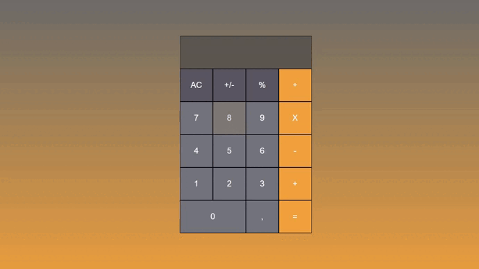

# Calculator Grid

>  A grid calculator made with HTML, CSS and JavaScript.

Check the Application: https://kayke-fujinaka.github.io/calculator.js/
## :dart: Features ##

:heavy_check_mark: Estruturação da Calculadora com HTML;\
:heavy_check_mark: Estilização com CSS;\
:heavy_check_mark: Utilizando JavaScript para calculadora Funcionar;\
:heavy_check_mark: FInalizado;

## :rocket: Technologies ##

The following tools were used in this project:

- [Html](https://developer.mozilla.org/pt-BR/docs/Web/HTML/Element/html/)  
- [CSS](https://developer.mozilla.org/pt-BR/docs/Web/CSS)  
- [JavaScript](https://developer.mozilla.org/pt-BR/docs/Web/JavaScript) 
## 🤝 Collaborators

We thank the following people who contributed to this project:

<table>
  <tr>
    <td align="center">
      <a href="#">
         
        
          <b>Kayke Alves Fujinaka</b>
        
      </a>
    </td>
  </tr>
</table>

## 📝 License

This project is under license. See the [LICENSE](LICENSE.md) file for more details.

&#xa0;

<a href="#top">Back to top</a>
